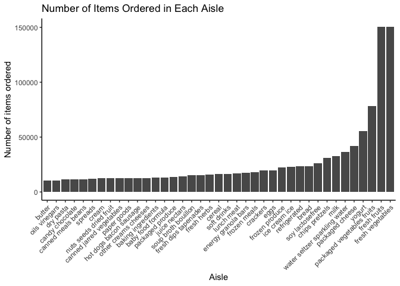

HW3
================
Stephen Powers
10/12/2019

## Problem 1

#### *Cleaning Instacart Dataset*

| order\_id | product\_id | add\_to\_cart\_order | reordered | user\_id | eval\_set | order\_number | order\_dow | order\_hour\_of\_day | days\_since\_prior\_order | product\_name                                 | aisle\_id | department\_id | aisle                | department   |
| --------: | ----------: | -------------------: | --------: | -------: | :-------- | ------------: | ---------: | -------------------: | ------------------------: | :-------------------------------------------- | --------: | -------------: | :------------------- | :----------- |
|         1 |       49302 |                    1 |         1 |   112108 | train     |             4 |          4 |                   10 |                         9 | Bulgarian Yogurt                              |       120 |             16 | yogurt               | dairy eggs   |
|         1 |       11109 |                    2 |         1 |   112108 | train     |             4 |          4 |                   10 |                         9 | Organic 4% Milk Fat Whole Milk Cottage Cheese |       108 |             16 | other creams cheeses | dairy eggs   |
|         1 |       10246 |                    3 |         0 |   112108 | train     |             4 |          4 |                   10 |                         9 | Organic Celery Hearts                         |        83 |              4 | fresh vegetables     | produce      |
|         1 |       49683 |                    4 |         0 |   112108 | train     |             4 |          4 |                   10 |                         9 | Cucumber Kirby                                |        83 |              4 | fresh vegetables     | produce      |
|         1 |       43633 |                    5 |         1 |   112108 | train     |             4 |          4 |                   10 |                         9 | Lightly Smoked Sardines in Olive Oil          |        95 |             15 | canned meat seafood  | canned goods |
|         1 |       13176 |                    6 |         0 |   112108 | train     |             4 |          4 |                   10 |                         9 | Bag of Organic Bananas                        |        24 |              4 | fresh fruits         | produce      |

**Table 1**: Instacart Dataset

The `instacart` dataset contains 1384617 observations and 15 variables.
The variables in the dataset includes the following: order\_id,
product\_id, add\_to\_cart\_order, reordered, user\_id, eval\_set,
order\_number, order\_dow, order\_hour\_of\_day,
days\_since\_prior\_order, product\_name, aisle\_id, department\_id,
aisle, department

  - There are 134 total aisles in the
dataset.

| product\_id | product\_name          | aisle                      |     n |
| ----------: | :--------------------- | :------------------------- | ----: |
|       24852 | Banana                 | fresh fruits               | 18726 |
|       13176 | Bag of Organic Bananas | fresh fruits               | 15480 |
|       21137 | Organic Strawberries   | fresh fruits               | 10894 |
|       21903 | Organic Baby Spinach   | packaged vegetables fruits |  9784 |
|       47626 | Large Lemon            | fresh fruits               |  8135 |
|       47766 | Organic Avocado        | fresh fruits               |  7409 |
|       47209 | Organic Hass Avocado   | fresh fruits               |  7293 |
|       16797 | Strawberries           | fresh fruits               |  6494 |
|       26209 | Limes                  | fresh fruits               |  6033 |
|       27966 | Organic Raspberries    | packaged vegetables fruits |  5546 |
|       39275 | Organic Blueberries    | packaged vegetables fruits |  4966 |
|       27845 | Organic Whole Milk     | milk                       |  4908 |
|       30391 | Organic Cucumber       | fresh vegetables           |  4613 |
|       45007 | Organic Zucchini       | fresh vegetables           |  4589 |
|       22935 | Organic Yellow Onion   | fresh vegetables           |  4290 |

**Table 2**: Most ordered items

  - From the table created above, we see that the most ordered items are
    from the “fresh fruits” and “packaged vegetables fruits”
aisles.

<!-- -->

#### *Creating a table showing the three most popular items in each of the aisles “baking ingredients”, “dog food care”, and “packaged vegetables fruits”.*

| rank | product\_name\_baking ingredients | product\_name\_dog food care                    | product\_name\_packaged vegetables fruits | number\_orders\_baking ingredients | number\_orders\_dog food care | number\_orders\_packaged vegetables fruits |
| ---: | :-------------------------------- | :---------------------------------------------- | :---------------------------------------- | ---------------------------------: | ----------------------------: | -----------------------------------------: |
|    1 | Light Brown Sugar                 | Organix Grain Free Chicken & Vegetable Dog Food | Organic Baby Spinach                      |                                157 |                            14 |                                       3324 |
|    2 | Pure Baking Soda                  | Organix Chicken & Brown Rice Recipe             | Organic Raspberries                       |                                140 |                            13 |                                       1920 |
|    3 | Organic Vanilla Extract           | Original Dry Dog                                | Organic Blueberries                       |                                122 |                             9 |                                       1692 |

**Table 3**: Three most popular items in each of the aisles baking
ingredients, dog food care, and packaged vegetables
fruits

#### *Creating a table showing the mean hour of the day at which Pink Lady Apples and Coffee Ice Cream are ordered on each day of the week*

| product\_name    |   Sunday |   Monday |  Tuesday | Wednesday | Thursday |   Friday | Saturday |
| :--------------- | -------: | -------: | -------: | --------: | -------: | -------: | -------: |
| Coffee Ice Cream | 13.77419 | 14.31579 | 15.38095 |  15.31818 | 15.21739 | 12.26316 | 13.83333 |
| Pink Lady Apples | 13.44118 | 11.36000 | 11.70213 |  14.25000 | 11.55172 | 12.78431 | 11.93750 |

**Table 4**: Mean hour of the day at which Pink Lady Apples and Coffee
Ice Cream are
ordered

## Problem 2

#### *Renaming and cleaning data `brfss_smart2010`*

#### *Formatting a new dataset to focus on the “Overall Health” topic*

#### *Creating a table for states that were observed at 7 or more location in 2002*

| state | number\_locations |
| :---- | ----------------: |
| CT    |                 7 |
| FL    |                 7 |
| MA    |                 8 |
| NC    |                 7 |
| NJ    |                 8 |
| PA    |                10 |

**Table 5**: States that were observed at 7 or more locations (year
=2002)

#### *Creating a table for states that were observed at 7 or more location in 2010*

| state | number\_locations |
| :---- | ----------------: |
| CA    |                12 |
| CO    |                 7 |
| FL    |                41 |
| MA    |                 9 |
| MD    |                12 |
| NC    |                12 |
| NE    |                10 |
| NJ    |                19 |
| NY    |                 9 |
| OH    |                 8 |
| PA    |                 7 |
| SC    |                 7 |
| TX    |                16 |
| WA    |                10 |

**Table 6**: States that were observed at 7 or more locations (year =
2010)

## Problem 3
